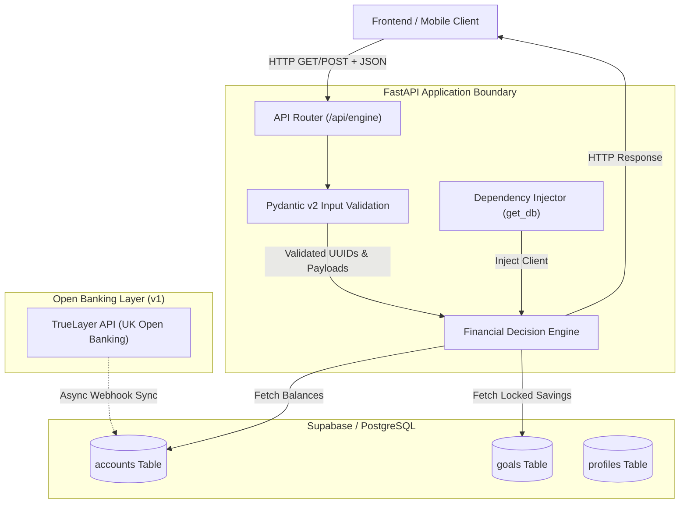

# Financial Copilot Engine

[](https://www.python.org/)
[](https://fastapi.tiangolo.com/)
[](https://supabase.com/)
[](https://docs.pydantic.dev/)

> **AI Financial Coach Backend Engine**  
> A high-performance, deterministic financial decision engine built with Python 3.13, FastAPI, Pydantic v2, and Supabase PostgreSQL. Designed around the core hero metric: **Daily Safe-to-Spend**.

---

## 1. Product Thesis and Core Philosophy

Traditional personal finance applications rely heavily on manual expense tracking, post-hoc budget reconciliation, or arbitrary composite scores (e.g., "72/100") that lack actionable meaning.

### The Hero Metric: Daily Safe-to-Spend
Before making daily discretionary purchases, consumers require a single, trustworthy number: **"How much can I spend today without compromising my monthly savings and fixed obligations?"**

The Financial Copilot backend centers its architecture around calculating a bulletproof **Daily Safe-to-Spend** figure:

$$\text{Safe-to-Spend} = \text{Total Account Balances} - \text{Locked Savings Goals}$$

By coupling deterministic database arithmetic with a time-based monthly burn-rate calculation, the engine provides immediate, high-confidence spending boundaries.

---

## 2. System Architecture

The service architecture strictly decouples **deterministic financial math** from **natural-language explanation**. All calculations are executed directly in Python and constrained at the database layer, eliminating LLM hallucination risks in core decision paths.



---

## 3. Core Features and Scope Boundaries

### MVP v1 Deliverables
- **Daily Safe-to-Spend**: Real-time calculation across connected user accounts and savings targets (`GET /api/engine/safe-to-spend/{user_id}`).
- **Single-Purchase Affordability Check**: Evaluate purchase impact against remaining monthly budget and days remaining in the billing period (`POST /api/engine/affordability/{user_id}`).
- **Strict Boundary Validation**: Type-safe input parsing via Pydantic v2 enforcing UUID structure and positive financial metrics (`cost_pence > 0`).
- **Dependency Injection**: Isolated Supabase client dependency injection (`get_db`) enabling seamless unit testing and database pooling.

### Deferred for v2
- Automated 90-day PSD2/FCA Open Banking re-consent workflow.
- Fixed recurring transaction (bills) deduction from daily allowance.
- Preset AI guidance actions ("Why am I over budget?", "How do I save £100/mo?").

### Out of Scope (Architectural Constraints)
- **Unconstrained Freeform Chatbots**: Unrestricted generative models executing financial math introduce unacceptable variance and hallucination.
- **Arbitrary Health Scores**: Non-actionable composite scoring metrics.
- **Redundant Dashboard Widgets**: Eliminating UI noise to present a clear, calm financial status.

---

## 4. Decision Engine Logic and Formulation

### Safe-to-Spend Calculation
```python
total_balance = sum(account["current_balance_pence"] for account in accounts)
locked_savings = sum(goal["current_balance_pence"] for goal in goals)

safe_to_spend_pence = total_balance - locked_savings
```

### Purchase Affordability Algorithm
When evaluating a proposed purchase of `cost_pence`:

1. **Deficit Check**: If `cost_pence > safe_to_spend_pence`, return Verdict: `NO`.
2. **Weekly Allowance Burn Rate**:
   $$\text{Weekly Allowance} = \left( \frac{\text{Current Safe Pence}}{\text{Days Remaining in Month}} \right) \times 7$$
   If `cost_pence > weekly_allowance`, return Verdict: `WARNING` (*"Consumes more than one week of remaining budget"*).
3. **Approval**: Otherwise, return Verdict: `YES` (*"Well within daily spending limits"*).

---

## 5. API Reference

### Health Check
```http
GET /health
```
**Response (200 OK):**
```json
{
  "status": "healthy",
  "engine": "running"
}
```

---

### Fetch Safe-to-Spend Balance
```http
GET /api/engine/safe-to-spend/{user_id}
```
**Path Parameters:**
- `user_id` (*string*, required): Valid UUID format (e.g., `41a2d672-42da-4b01-b26c-66c4894a9721`).

**Response (200 OK):**
```json
{
  "safe_to_spend_pence": 24500,
  "currency": "GBP"
}
```

**Error Response (422 Unprocessable Entity):**
```json
{
  "detail": [
    {
      "type": "uuid_parsing",
      "loc": ["path", "user_id"],
      "msg": "Input should be a valid UUID"
    }
  ]
}
```

---

### Evaluate Purchase Affordability
```http
POST /api/engine/affordability/{user_id}
Content-Type: application/json
```
**Request Body:**
```json
{
  "item_name": "Wireless Headphones",
  "cost_pence": 4500
}
```

**Response (200 OK):**
```json
{
  "verdict": "YES",
  "impact_percentage": 18.4,
  "safe_to_spend_after_pence": 20000,
  "reasoning": "Well within your healthy daily spending limits."
}
```

**Error Response (422 Unprocessable Entity - Invalid Input):**
```json
{
  "detail": [
    {
      "type": "greater_than",
      "loc": ["body", "cost_pence"],
      "msg": "Input should be greater than 0"
    }
  ]
}
```

---

## 6. Repository Layout

```
copilot-backend/
├── api/
│   ├── __init__.py
│   └── engine.py         # Financial math endpoints & Pydantic models
├── core/
│   ├── __init__.py
│   └── config.py         # Environment configuration settings
├── services/
│   ├── __init__.py
│   └── supabase_db.py    # Database client & dependency injection
├── .env.example
├── .gitignore
├── main.py               # FastAPI application entry point & router mounting
└── README.md
```

---

## 7. Local Setup and Installation

### Requirements
- Python 3.13+
- Supabase PostgreSQL instance

### Environment Setup
```bash
# Clone repository
git clone https://github.com/siddharth10-dev/financial-copilot-backend.git
cd financial-copilot-backend

# Initialize virtual environment
python3 -m venv venv
source venv/bin/activate

# Install dependencies
pip install fastapi uvicorn supabase pydantic python-dotenv httpx pytest
```

### Environment Variables
Configure `.env` using `.env.example`:
```env
SUPABASE_URL=https://your-project.supabase.co
SUPABASE_ANON_KEY=your-supabase-anon-key
```

### Running Server
```bash
uvicorn main:app --reload
```
Server runs locally at `http://127.0.0.1:8000`. OpenAPI documentation is accessible at `http://127.0.0.1:8000/docs`.

---

## 8. Verification and Testing

Integration tests can be run using `pytest` or `TestClient`:
```bash
python -c "
import uuid
from main import app
from fastapi.testclient import TestClient

client = TestClient(app)
test_uuid = str(uuid.uuid4())

print('Health Check:', client.get('/health').status_code)
print('Safe-to-Spend:', client.get(f'/api/engine/safe-to-spend/{test_uuid}').status_code)
"
```

---

## 9. License

Distributed under the MIT License.
