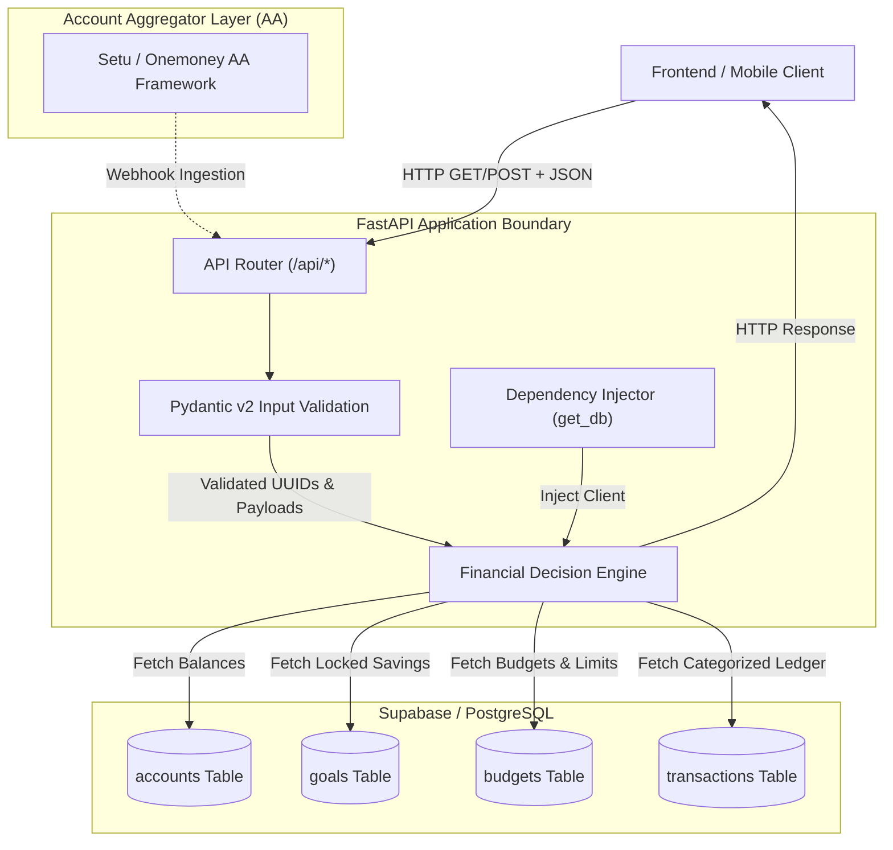

# Financial Copilot Engine

[](https://www.python.org/)
[](https://fastapi.tiangolo.com/)
[](https://supabase.com/)
[](https://docs.pydantic.dev/)

> **AI Financial Coach Backend Engine**  
> A high-performance, deterministic financial decision engine built with Python 3.13, FastAPI, Pydantic v2, and Supabase PostgreSQL. Designed around the core hero metric: **Daily Safe-to-Spend**, with native support for the Indian Account Aggregator (AA) framework.

---

## 1. Product Thesis and Core Philosophy

Traditional personal finance applications rely heavily on manual expense tracking, post-hoc budget reconciliation, or arbitrary composite scores (e.g., "72/100") that lack actionable meaning.

### The Hero Metric: Daily Safe-to-Spend
Before making daily discretionary purchases, consumers require a single, trustworthy number: **"How much can I spend today without compromising my monthly savings and fixed obligations?"**

The Financial Copilot backend centers its architecture around calculating a bulletproof **Daily Safe-to-Spend** figure:

$$\text{Safe-to-Spend} = \text{Total Account Balances} - \text{Locked Savings Goals}$$

By coupling deterministic database arithmetic with a time-based monthly burn-rate calculation, the engine provides immediate, high-confidence spending boundaries.

---

## 2. System Architecture

The service architecture strictly decouples **deterministic financial math** from **natural-language explanation**. All calculations are executed directly in Python and constrained at the database layer, eliminating LLM hallucination risks in core decision paths.



---

## 3. Core Features and Scope Boundaries

### MVP v1 Deliverables
- **Daily Safe-to-Spend**: Real-time calculation across connected user accounts and savings targets (`GET /api/engine/safe-to-spend/{user_id}`).
- **Single-Purchase Affordability Check**: Evaluate purchase impact against remaining monthly budget and days remaining in the billing period (`POST /api/engine/affordability/{user_id}`).
- **Bank Sync via Account Aggregator**: Consent generation and automated webhook data ingestion for Indian financial ecosystems (`POST /api/bank_sync/consent/{user_id}` and `POST /api/bank_sync/webhook`).
- **Goals & Budgets**: Month-independent category limits and target savings tracker (`/api/goals` and `/api/budgets`).
- **Recent Transactions Ledger**: Account-level transaction fetching with category relational joins (`/api/transactions`).

---

## 4. Decision Engine Logic and Formulation

### Safe-to-Spend Calculation
```python
total_balance = sum(account["current_balance_pence"] for account in accounts)
locked_savings = sum(goal["current_balance_pence"] for goal in goals)

safe_to_spend_pence = total_balance - locked_savings
```

### Purchase Affordability Algorithm
When evaluating a proposed purchase of `cost_pence`:

1. **Deficit Check**: If `cost_pence > safe_to_spend_pence`, return Verdict: `NO`.
2. **Weekly Allowance Burn Rate**:
   $$\text{Weekly Allowance} = \left( \frac{\text{Current Safe Pence}}{\text{Days Remaining in Month}} \right) \times 7$$
   If `cost_pence > weekly_allowance`, return Verdict: `WARNING` (*"Consumes more than one week of remaining budget"*).
3. **Approval**: Otherwise, return Verdict: `YES` (*"Well within daily spending limits"*).

---

## 5. API Reference

### 5.1 Engine Endpoints (`/api/engine`)
- `GET /health` — Service health check.
- `GET /api/engine/safe-to-spend/{user_id}` — Returns calculated safe-to-spend pence balance.
- `POST /api/engine/affordability/{user_id}` — Evaluates item purchase affordability.

### 5.2 Bank Sync Endpoints (`/api/bank_sync`)
- `POST /api/bank_sync/consent/{user_id}` — Generates AA consent link for user approval.
- `POST /api/bank_sync/webhook` — Webhook endpoint called by Account Aggregator upon consent activation. Upserts account details and ingests transaction data.

### 5.3 Goals Endpoints (`/api/goals`)
- `GET /api/goals/{user_id}` — Fetches target goals and current balance.
- `POST /api/goals/{user_id}` — Creates a new savings goal.

### 5.4 Budgets Endpoints (`/api/budgets`)
- `GET /api/budgets/{user_id}?month_year=YYYY-MM` — Fetches month-independent category budget limits.
- `POST /api/budgets/{user_id}` — Upserts monthly budget limit for a category.

### 5.5 Transactions Endpoints (`/api/transactions`)
- `GET /api/transactions/{user_id}?limit=50` — Retrieves recent transactions joined with category metadata.

---

## 6. Repository Layout

```
copilot-backend/
├── api/
│   ├── __init__.py
│   ├── bank_sync.py      # Indian Account Aggregator consent & webhook engine
│   ├── budgets.py        # Month-independent budget limits API
│   ├── engine.py         # Financial math endpoints & Pydantic models
│   ├── goals.py          # Savings goals CRUD API
│   └── transactions.py   # Transaction history API
├── core/
│   ├── __init__.py
│   └── config.py         # Environment configuration settings
├── services/
│   ├── __init__.py
│   └── supabase_db.py    # Database client & dependency injection
├── .env.example
├── .gitignore
├── main.py               # FastAPI application entry point & router mounting
└── README.md
```

---

## 7. Local Setup and Testing

### Setup Environment
```bash
# Clone repository
git clone https://github.com/siddharth10-dev/financial-copilot-backend.git
cd financial-copilot-backend

# Virtual environment & dependencies
python3 -m venv venv
source venv/bin/activate
pip install fastapi uvicorn supabase pydantic python-dotenv httpx pytest

# Start local server
uvicorn main:app --reload
```

---

## 8. License

Distributed under the MIT License.
